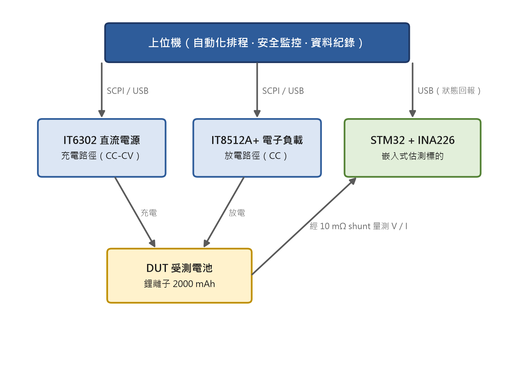
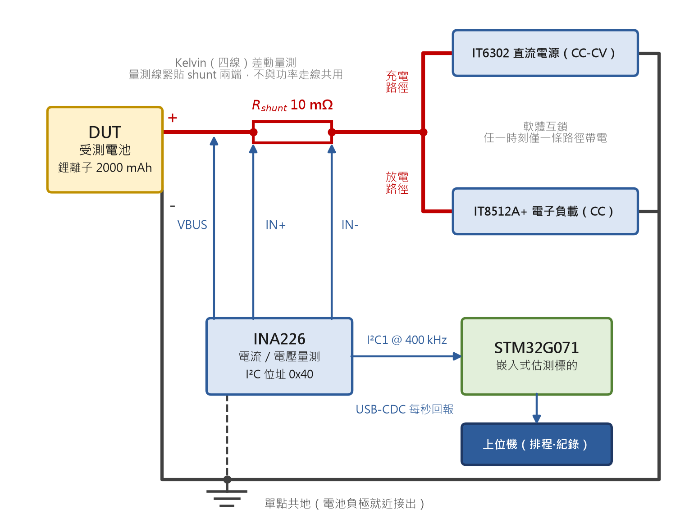

# 第三章 嵌入式量測與測試平台

## 3.1 系統架構

本研究建構的測試平台同時扮演兩個角色：其一為**電池特性激勵與真值量測平台**，由可程式直流電源供應器與可程式電子負載對電池施加受控的充放電激勵，並以高精度儀錶記錄電壓、電流真值；其二為**嵌入式估測標的**，由一顆 STM32 微控制器搭配 INA226 電流／電壓量測晶片，作為三種 SOC 估測演算法的實際運行載體。兩個角色共用同一顆受測電池（Device Under Test, DUT）與同一條高功率量測迴路，使「儀錶量到的真值」與「MCU 估出的 SOC」得以逐點對齊比較。整體架構如圖 3-1 所示。

> 圖 3-1　測試平台系統架構：上位機經序列埠驅動電源與電子負載，並接收嵌入式端的狀態回報；受測電池經 10 mΩ shunt 由 INA226 量測電流與電壓

平台各組成的角色與規格整理如表 3-1。受測電池為一顆客製化 NMC 鋰離子電池（標稱容量 2000 mAh，充電截止電壓 $V_{cv}=4.2$ V，放電截止電壓 $V_{cut}=2.5$ V，最大放電電流 4 A）。

| 組成 | 型號／規格 | 介面 | 角色 |
|---|---|---|---|
| 微控制器 | STM32G071RBTx（Nucleo-G071RB，板載 ST-Link V2.1），SYSCLK 64 MHz | — | 嵌入式估測標的、每秒狀態回報 |
| 電流／電壓量測 | INA226，I²C 位址 0x40，$R_{shunt}$ 標稱 10 mΩ | I²C1 @ 400 kHz | MCU 端 V／I 取樣 |
| 直流電源 | ITECH IT6302（CC-CV） | SCPI / USB-CDC，9600 8N1 | 充電路徑 + 充電真值 |
| 電子負載 | ITECH IT8512A+（CC 模式） | SCPI / USB-CDC，9600 8N1 | 放電路徑 + 放電真值 |
| 上位機 | Python orchestrator（樹莓派／PC） | USB 三埠 | 排程、互鎖、紀錄 |

量測迴路採單點共地的 Kelvin（四線）連接：電池正極經 10 mΩ shunt 串接至電源／負載，INA226 的 IN+／IN− 緊貼 shunt 兩端做差動電流量測、VBUS 量測電池端點電壓，並由電池負極就近單點接出邏輯地，以避免 shunt 壓降耦合進邏輯供電（詳細腳位與訊號完整性見附錄 A）。充電與放電為兩條獨立路徑，由上位機在軟體層確保任一時刻僅一條路徑帶電（3.4 節）。

上位機與三個設備各以一條 USB 序列埠通訊：對電源與電子負載下達控制指令，並接收微控制器每秒回報一次的電壓／電流／SOC 估測值。如此，同一充放電事件同時被「儀錶真值」與「微控制器估測」兩路獨立記錄，構成第四章逐點誤差分析的資料基礎。

## 3.2 韌體骨架

為使第四章三種 SOC 演算法在「完全相同的執行環境」下運行，本研究先建立一套統一的韌體骨架：三種估測方法都掛在這套骨架上，只替換最核心的估測模組，其餘的時間節拍、輸入輸出與量測路徑完全一致，以免因執行環境差異污染比較結果。骨架的設計圍繞三個重點。

**固定的系統節拍**：微控制器內部以一個高精度計時器每隔極短的固定時間（百微秒等級）產生一次節拍，作為全系統的共同時間基準。需要週期性動作（例如每秒回報一次狀態）時，只要累計到足夠的節拍數即可觸發，不必另外量測時間。節拍本身只做計數、不做任何運算或輸出，以免拖慢系統反應。

**「開機初始化一次、之後反覆執行」的主架構**：開機後先將各功能模組依序初始化（通訊埠、量測晶片、校正資料載入等）一次，接著進入主迴圈反覆執行各模組的例行工作，並依節拍分派週期性事件。若量測晶片在開機時未被偵測到，系統會以警告繼續運行而非直接中止——量測平台必須在感測器缺席時仍能存活。

**模組化的功能切分**：應用功能被切成數個獨立模組，各自只負責一件事、彼此低耦合，以利維護與替換。主要模組與其職責整理如表 3-2，其中「SOC 估測模組」即第四章三種方法的共同掛載點。

| 模組 | 職責 |
|---|---|
| 除錯通訊 | 透過序列埠輸出狀態與訊息，供上位機即時監看 |
| 量測匯流排 | 與電流／電壓量測晶片（INA226）通訊、讀寫其設定與資料 |
| 電池量測 | 設定量測晶片並取得最新的電壓、電流、功率讀值 |
| 校正套用 | 載入多點校正資料並套用於原始讀值（見 3.3 節） |
| SOC 估測 | 第四章三種估測方法掛載於此 |

骨架每秒回報一行狀態（電壓、電流、校正後電流、功率，以及各模組是否正常），供上位機即時監看與紀錄。校正資料一次燒入微控制器的非揮發性記憶體後，開機便自動載入，因此回報的電流已是校正後的數值（校正細節見 3.3 節）。此骨架即為第四章三種估測方法的共同載體：三者只替換最核心的估測模組，其餘部分完全相同，以確保比較的公平性。整體骨架與三種方法的掛載關係如圖 3-2 所示——每秒一次的量測、校正與回報構成共同管線，三種估測方法並列掛於其中的估測模組；各方法另有獨立的開關，可在同一編譯設定下個別納入或剔除，此即 4.4.3 節量測各方法淨資源佔用的基礎。

> 圖 3-2　韌體骨架與三種 SOC 估測方法之掛載關係（估測模組為第四章三法之共同掛載點，各自可獨立開關）

## 3.3 INA226 多點線性內插校正

第四章所有 SOC 方法都以電流積分為基礎（庫倫計數為直接積分，EKF 與動態阻抗亦需準確電流），故電流量測精度是整個平台的根基。INA226 出廠後的原始讀值存在顯著系統性偏差，必須先行校正。

**校正前偏差**：以電子負載拉定電流為真值，比對 MCU 原始讀值，發現 INA226 電流系統性偏高約 **15.8%**（200 mA 時讀為 230.4 mA），主因是 shunt 實際阻值偏離標稱 10 mΩ，加上 PCB 走線串聯阻抗與 ADC 零點偏移。此偏差若不校正，將直接以同等比例污染所有 SOC 估測。

**校正設計**：採分方向各 7 點、合計 14 點的線性內插校正。校正電流點為

$$\{0,\ 0.05,\ 0.10,\ 0.50,\ 1.00,\ 1.50,\ 2.00\}\ \text{A}$$

充電方向以 IT6302、放電方向以 IT8512A+ 提供真值；之所以分方向各建一張查找表（Look-Up Table, LUT），是因 INA226 的零點偏移對電流方向可能不對稱。選點兼顧低電流區（offset 主導，0、0.05、0.10 A）與高電流區（shunt 線性度與純比例縮放，0.5～2.0 A，其中 2.0 A = 1C @ 2000 mAh）。每點時序為：寫入設定值並以 readback 驗證（容差 $\max(5\ \text{mA},\,5\%)$）→ 3 s 穩態 → 5 s 並行採樣（儀錶每 0.4 s、MCU 每 1 s）取平均。

**校正觀察**：原始數據呈現三項一致規律：(1) 充放電同電流點的比值（ref/mcu）一致到小數第三位，確認 shunt 量測對方向無偏；(2) 0 A 零點偏移為 +1.10 mA（兩方向同號）；(3) 高電流區（> 500 mA）比值收斂至 0.880，等價於 shunt 實際阻值 $\approx 10/0.880 = 11.36$ mΩ（較標稱 +13.6%），或等價於將電流最低有效位元由 152.6 µA/LSB 改為 134.3 µA/LSB。低電流區比值下降至 0.85，符合「固定 +1.10 mA offset 在小電流上佔比放大」的純 offset 主導模型。

**校正模型**：採分段線性內插（piecewise-linear），不使用多項式擬合。給定 MCU 讀值 $I_{mcu}$，於 LUT 中找包夾區間 $[m_k, m_{k+1}]$ 後線性內插得真值估計 $I_{ref}$；超出範圍則以首／末段斜率外插。此法相較單一比例或多項式，更能同時吻合低電流 offset 與高電流線性兩種行為。

**內插驗證**：以未列入校正表的 4 個獨立電流點（0.30、0.75、1.25、1.75 A）驗證 LUT 內插預測對真值的誤差，結果如表 3-3。

| 目標 (A) | 真值 (mA) | MCU 原始 (mA) | LUT 預測 (mA) | 預測誤差 (mA) |
|---:|---:|---:|---:|---:|
| 0.300 | 298.31 | 340.20 | 298.10 | −0.21 |
| 0.750 | 748.78 | 851.32 | 748.56 | −0.21 |
| 1.250 | 1248.46 | 1418.52 | 1248.29 | −0.17 |
| 1.750 | 1748.61 | 1986.30 | 1748.44 | −0.16 |

全範圍誤差 **< 0.21 mA**，相當於 1.75 A 的 **0.012%**（< 1‰）。校正前原始偏差為 +41～+238 mA（約 +13%～+16% 系統性偏高），校正後降至 < 1‰；連同 shunt 容差一併校正後，實測精度優於 INA226 資料手冊標稱的 ±0.1%（該標稱不含 shunt 容差）。此校正成果為第四章所有以電流積分為基礎的估測提供了可信賴的量測根基；校正過程之完整紀錄另見校正紀錄文件。

## 3.4 跨輪自動化測試協定

第四章的方法比較需要橫跨多種放電倍率、且可跨多輪累積的乾淨資料，本研究為此設計了一套由上位機自動執行的跨輪測試協定。

**一輪的結構**：一輪由四組「充電 → 休息 → 放電 → 休息」串成，充電一律以 0.5C 進行（高倍率充電會傷害電池並污染健康度基準），四組的放電倍率依序為 0.5C、1.0C、1.5C、2.0C，每次轉向之間休息 30 分鐘讓電池鬆弛，一輪約 16～18 小時。協定流程如表 3-4：每一組都是相同的四步驟，只有放電倍率不同。

| 組別 | 一組的流程（充電固定 0.5C） | 放電倍率 | 目的 |
|:---:|---|:---:|---|
| 1 | 充飽 → 休息 30 分 → 放電至截止 → 休息 30 分 | 0.5C | 取得 0.5C 基準放電曲線 |
| 2 | 充飽 → 休息 30 分 → 放電至截止 → 休息 30 分 | 1.0C | 倍率能力 |
| 3 | 充飽 → 休息 30 分 → 放電至截止 → 休息 30 分 | 1.5C | 倍率能力 |
| 4 | 充飽 → 休息 30 分 → 放電至截止 → 休息 30 分 | 2.0C | 倍率能力 |

**CC-CV 充電終止判斷**：充電採標準定電流—定電壓（CC-CV）方式，當端電壓達到截止電壓 $V_{cv}$、且充電電流衰減至 $0.1$C 以下時，即判定充飽並結束該充電步。

**放電中的 dV/dI 擾動**：放電步在 CC 基礎上週期性注入電流擾動，直接服務第四章的動態阻抗法 [1], [4]。每 60 s 由基礎倍率短暫步降至 0.2C、停留 1 秒後步回，取步降前後兩個穩態樣本計算 $\Delta V/\Delta I$，即該 SOC 下的動態阻抗估計；基礎倍率越高，$\Delta I$ 越大，dV/dI 訊噪比越好，故四種放電倍率全數注入擾動。庫倫計數涵蓋擾動期間的秒數（含停留），以避免約 3% 的庫倫低估。

**跨輪持久化紀錄**：每完成一個充電或放電步，即向紀錄檔追加一列，記錄週期編號、輪次編號、方向、倍率、起訖電壓、安時量、容量保持率與累積 Ah。容量保持率定義為

$$q_{retention}\ (\%) = 100 \times \frac{q_{actual}}{q_{rated}}$$

週期編號在每次放電到截止時遞增，充電繼承其後放電的週期編號（一對充放電共用一個編號）；跨次執行時，程式自動讀回既有紀錄，續接輪次編號、週期編號與累積 Ah，達成無縫跨輪累積。本研究以連續三輪 fresh-cell baseline 驗證 0.5C 週期的容量保持率是否落在 95～100%，並計算輪間變異性，作為進入後續測試前的資料品質閘門（變異性分析見第五章）。

至此，本章已交代第四章三種 SOC 估測方法所需的主要基礎設施：統一的韌體載體（3.2）、可信的電流量測（3.3），以及乾淨且可累積的測試數據（3.4）。下一章將在此平台上，依「原理 → 演算法 → 嵌入式實作 → 實驗結果」的一致結構，分別實作並公平比較庫倫計數法、擴展卡爾曼濾波器與動態阻抗法。

---

## 參考文獻（本章引用，完整清單彙整於論文末）

- [1] C.-H. Lin, C.-M. Wang, and C.-Y. Ho, "Implementation of State-of-Charge and State-of-Health Estimation for Lithium-Ion Batteries," in Proc. IECON 2016 - 42nd Annu. Conf. IEEE Industrial Electronics Society, Florence, Italy, Oct. 2016, pp. 18-24.
- [2] G. L. Bressanini, T. D. C. Busarello, and A. Péres, "Design and Implementation of Lead-Acid Battery State-of-Health and State-of-Charge Measurements," in Proc. 2017 Brazilian Power Electronics Conference (COBEP), Juiz de Fora, Brazil, Nov. 2017, pp. 1-6.
- [3] A. Hasan, M. Skriver, and T. A. Johansen, "eXogenous Kalman Filter for Lithium-Ion Batteries State-of-Charge Estimation in Electric Vehicles," arXiv preprint arXiv:1810.09014, 2018.
- [4] Z. Song, J. Hou, X. Li, X. Wu, X. Hu, H. Hofmann, and J. Sun, "The Sequential Algorithm for Combined State of Charge and State of Health Estimation of Lithium-Ion Battery Based on Active Current Injection," arXiv preprint arXiv:1901.06000, 2019.
- [5] Y. Qin, S. Adams, and C. Yuen, "A Transfer Learning-Based State of Charge Estimation for Lithium-Ion Battery at Varying Ambient Temperatures," accepted by IEEE Transactions on Industrial Informatics, 2021 (preprint: arXiv:2101.03704).
- [6] B. Yi, X. Du, J. Zhang, X. Wu, Q. Hu, W. Jiang, X. Hu, and Z. Song, "Bias-Compensated State of Charge and State of Health Joint Estimation for Lithium Iron Phosphate Batteries," arXiv preprint arXiv:2401.08136, 2024.
- [7] A. Barros, E. Peretti, D. Fabroni, D. Carrera, P. Fragneto, and G. Boracchi, "Adaptive Extended Kalman Filtering for Battery State of Charge Estimation on STM32," arXiv preprint arXiv:2504.05936, 2025.
- [8] K. Movassagh, S. A. Raihan, B. Balasingam, and K. Pattipati, "A Critical Look at Coulomb Counting Towards Improving the Kalman Filter Based State of Charge Tracking Algorithms in Rechargeable Batteries," arXiv preprint arXiv:2101.05435, 2021.
- [9] S. Zhao and D. A. Howey, "Global Sensitivity Analysis of Battery Equivalent Circuit Model Parameters," arXiv preprint arXiv:1604.01293, 2016.
- [10] L. D. Couto and M. Kinnaert, "Partition-Based Unscented Kalman Filter for Reconfigurable Battery Pack State Estimation Using an Electrochemical Model," arXiv preprint arXiv:1709.07816, 2017.
- [11] A. Kulkarni, A. Nadeem, R. Di Fonso, Y. Zheng, and R. Teodorescu, "Novel Low-Complexity Model Development for Li-ion Cells Using Online Impedance Measurement," arXiv preprint arXiv:2402.07777, 2024.
- [12] I. Baccouche, S. Jemmali, A. Mlayah, B. Manai, and N. Essoukri Ben Amara, "Implementation of an Improved Coulomb-Counting Algorithm Based on a Piecewise SOC-OCV Relationship for SOC Estimation of Li-Ion Battery," arXiv preprint arXiv:1803.10654, 2018.
- [13] J. Knox, M. Blyth, and A. Hales, "Advancing State Estimation for Lithium-Ion Batteries with Hysteresis: Systematic Extended Kalman Filter Tuning," arXiv preprint arXiv:2311.16942, 2023.

---

## 中原格式對照（套版時參照，不列入正文）

| 項目 | 規範 |
|---|---|
| 紙張／邊界 | A4；上 2 cm、下 2 cm、右 2 cm、左 3 cm |
| 中文字體 | 內文標楷體；行距「最小行高」18 pt |
| 英文字體 | Times New Roman 12 pt |
| 章標題 | 「第三章 嵌入式量測與測試平台」置中，另起新頁 |
| 節標題 | 3.1、3.2…靠左；子層次靠左 |
| 圖／表標號 | 圖 3-1、表 3-1 依章編號，標題置於圖下／表上 |
| 正文頁碼 | 阿拉伯數字（接續前章） |
| 程式碼／指令 | 等寬字體；長腳本節錄移至附錄 C |
| 引用標註 | IEEE 數字式 [n]，參考文獻統一置於論文末 |
