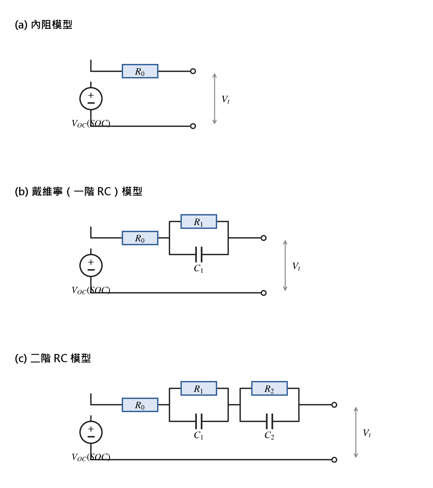

# 第二章 文獻回顧

> 章節草稿 — 對應 [論文大綱.md](論文大綱.md) §3 第二章。
> 定位：建立 SOC 估測方法的分類座標，並從「精度／強健性／嵌入式資源」三軸鋪陳本文選定三種方法（庫倫計數、EKF、動態阻抗）的依據，與第四章比較主軸前後呼應。
> 引用格式採 IEEE 數字式 [n]，沿用第一章編號 [1]–[2]（三篇參考論文）；標 `[待補引用]` 處為等效電路、卡爾曼濾波等通則性方法之外部出處，需查證後補真實文獻，本稿一律不虛構。
> 版面套版參數見文末「中原格式對照」。最後更新：2026-06-03

---

## 2.1 鋰離子電池基本原理與等效電路模型

### 2.1.1 端電壓的組成與 SOC 估測的根本困難

鋰離子電池在充放電過程中，其對外可量測的端電壓 $V_t$ 並非電池真實的熱力學電位，而是由多個成分疊加而成。一般可將其拆解為開路電壓、歐姆壓降與極化過電位三部分：

$$V_t = V_{OC}(SOC) - I \cdot R_0 - V_{pol}$$

其中 $V_{OC}(SOC)$ 為開路電壓（Open-Circuit Voltage, OCV），是電池在充分靜置、內部達到電化學平衡後的端電壓，與 SOC 之間存在單調對應關係；$I \cdot R_0$ 為流經電池歐姆內阻 $R_0$（含電極、電解液與接觸電阻）所產生的瞬時壓降；$V_{pol}$ 則為電荷轉移與濃度擴散等極化效應隨時間累積的過電位，具有明顯的時間常數，在電流變化後需數秒至數十分鐘才會鬆弛至穩態 [1]。

正是上述組成使 SOC 估測在動態工況下格外困難：在有負載電流時，端電壓被歐姆壓降與極化過電位「污染」，與真實 OCV 之間存在隨電流大小、方向、溫度與老化程度而變的偏差；相同的端電壓在不同負載條件下可能對應到截然不同的真實 SOC。此外，鋰離子電池（尤其是 LFP 體系）的 OCV–SOC 曲線在部分區段呈現遲滯（hysteresis）與電壓平台，使得「以端電壓反推 SOC」這一最直觀的想法在工程上無法單獨成立 [1]。因此，多數實用的 SOC 估測方法都需要藉助一個能描述「電流如何影響端電壓動態」的電池模型，將量測到的端電壓「還原」成可用以推估 SOC 的資訊，這即是等效電路模型（Equivalent Circuit Model, ECM）的角色。本章後續討論的三種等效電路模型，其電路結構如圖 2-1 所示。

> 圖 2-1　三種等效電路模型：(a) 內阻模型、(b) 戴維寧（一階 RC）模型、(c) 二階 RC 模型

### 2.1.2 內阻模型（Rint Model）

內阻模型是最簡化的等效電路，以一個理想電壓源 $V_{OC}(SOC)$ 串聯一個歐姆內阻 $R_0$ 來描述電池：

$$V_t = V_{OC}(SOC) - I \cdot R_0$$

此模型僅捕捉歐姆壓降，完全忽略極化的暫態行為。其優點是參數少、運算量極低，適合算力極度受限或僅需粗略估測的場合；缺點是在電流劇烈變化或高 C-rate 工況下誤差顯著，因為它無法表達電壓在電流階躍後的緩慢鬆弛。內阻模型常作為更高階模型的退化特例，或作為理論分析的起點 [4]。

### 2.1.3 戴維寧／一階 RC 模型（Thevenin / 1-RC Model）

為描述極化的暫態，戴維寧模型在內阻模型之上串聯一組並聯的 RC 網路（極化電阻 $R_1$ 與極化電容 $C_1$），以一個時間常數 $\tau_1 = R_1 C_1$ 近似電荷轉移與擴散的鬆弛過程：

$$\begin{cases} \dot{V}_1 = -\dfrac{1}{R_1 C_1} V_1 + \dfrac{1}{C_1} I \\ V_t = V_{OC}(SOC) - I \cdot R_0 - V_1 \end{cases}$$

一階 RC 模型在精度與複雜度之間取得了良好折衷，能合理重現電流階躍後的電壓回彈，是嵌入式 SOC 估測（尤其搭配卡爾曼濾波器）最常採用的模型結構之一 [4]。其狀態通常取為 $[SOC, V_1]^T$，恰可納入狀態空間框架，故與 EKF 的搭配在工業界相當普遍。

### 2.1.4 二階 RC／雙極化模型（2-RC / DP Model）

當需要同時刻畫快、慢兩種時間尺度的極化過程時，可採用串聯兩組 RC 網路的二階 RC 模型（又稱雙極化模型，Dual-Polarization）：以較小的 $\tau_1$ 描述電荷轉移的快速極化、較大的 $\tau_2$ 描述濃度擴散的緩慢極化。二階 RC 模型在寬電流範圍與全 SOC 區段的端電壓擬合精度優於一階模型，代價是多出兩個待辨識參數與一個狀態變數，運算與參數辨識成本相應提高，在算力受限的 MCU 上需審慎評估其效益是否值得 [4]。

三種等效電路模型的取捨可整理如下表：

| 模型 | 狀態維度 | 參數量 | 暫態描述能力 | 嵌入式適用性 |
|---|---|---|---|---|
| 內阻 Rint | 1（SOC） | $R_0$ | 無（僅歐姆） | 極佳，但動態誤差大 |
| 戴維寧 1-RC | 2（SOC, $V_1$） | $R_0, R_1, C_1$ | 單一時間常數 | 佳，精度／成本平衡點 |
| 二階 2-RC | 3（SOC, $V_1, V_2$） | $R_0, R_1, C_1, R_2, C_2$ | 快慢雙時間常數 | 中，精度高但成本較高 |

本論文於第四章實作 EKF 時，將以一階 RC 模型作為基礎結構，理由是其狀態維度低、參數辨識相對容易，且在本研究單一 NMC 電池、室溫條件下已足以支撐合理的端電壓重建（詳見第四章）。

## 2.2 SOC 估測方法分類

承第一章所述，SOC 為電池內部狀態，無法直接量測，僅能由端電壓、電流與溫度等可量測量間接推估 [1]。文獻中的 SOC 估測方法眾多，依其推估原理大致可分為兩類：（一）**直接計量法**，包含庫倫計數法與開路電壓查表法，直接由電量或電壓推算 SOC；（二）**模型基礎法**，以等效電路模型搭配狀態估測器（如卡爾曼濾波器族）或以電氣特性變化量推估 SOC（如動態阻抗法）。本節依此分類逐一回顧，並在每種方法後標註其在精度、強健性與嵌入式資源上的特性，為 2.4 節的方法選擇鋪陳依據。

### 2.2.1 庫倫計數法（Coulomb Counting）

庫倫計數法（又稱安時積分法）是最直接的 SOC 計量方式，其原理為對流經電池的電流積分以累計電量變化：

$$SOC(t) = SOC(t_0) - \frac{1}{C_{rated}} \int_{t_0}^{t} I(\tau)\, d\tau$$

其中 $SOC(t_0)$ 為初始 SOC，$C_{rated}$ 為額定容量，$I(\tau)$ 為電流（放電為正）[2]。庫倫計數法的優點是原理單純、運算量極低、瞬時動態響應好，且在電流量測準確時短時間內精度甚高，因此在本論文中兼任三種方法比較的 **基準真值（ground truth）**——以高精度 INA226 校正後的電流積分作為其他方法的精度對照（詳見第三、四章）。

然而庫倫計數法存在三項根本弱點，使其無法單獨長期可靠運行 [2]：

1. **依賴準確初始值**：積分式以 $SOC(t_0)$ 為起點，若初值未知或錯誤，誤差將永久存在於後續所有估測中。
2. **誤差累積（drift）**：電流量測的微小偏移（offset）會被時間積分持續放大，長時間運行後 SOC 將緩慢漂移而無自我修正能力。
3. **容量衰退**：額定容量 $C_{rated}$ 隨溫度、C-rate 與老化而變，若以固定值近似將引入系統性誤差。

正因如此，商用 BMS 鮮少單用庫倫計數，而多以其他方法（如 OCV 修正）週期性校正其累積誤差，詳見 2.3 節。

### 2.2.2 開路電壓查表法（OCV Look-up）

開路電壓查表法利用 OCV 與 SOC 之間的單調對應關係，先量得電池靜置後的 OCV，再反查預先建立的 OCV–SOC 表得到 SOC。由於該對應關係在固定溫度與化學體系下相當穩定，OCV 查表法可提供「絕對」的 SOC 參考，恰可補庫倫計數「無絕對基準」之不足。

然而 OCV 查表法作為**獨立即時方法**有其根本限制：

1. **需長時間靜置**：端電壓須待極化過電位充分鬆弛才趨近真實 OCV，文獻指出通常需靜置 2 小時以上，使其無法在電池工作（有負載）時即時運作。
2. **平台區與遲滯**：部分化學體系（尤以 LFP）的 OCV–SOC 曲線存在電壓平台與充放電遲滯，平台區內微小電壓誤差會對應到極大的 SOC 誤差，使單點查表失準。
3. **建表成本**：高品質 OCV 表須以小電流斷續滴定（GITT）等標準協定耗時建立。

實務上 OCV 查表極少作為獨立方法使用，而是作為其他方法的**校正錨點**或**觀測依據**。本論文採後者：以 GITT 標準協定建立 pseudo-OCV 表（取放電向與充電向平衡電壓之平均以折衷遲滯），作為第四章 EKF 觀測方程的 OCV–SOC 對應；OCV 查表本身因與本研究的 rate-capability 測試協定不相容，不列入方法比較（決策理由詳見 [論文大綱.md](論文大綱.md) §5）。

### 2.2.3 卡爾曼濾波器族（KF / EKF / UKF）

卡爾曼濾波器（Kalman Filter, KF）是模型基礎 SOC 估測的代表，其核心思想是將 SOC 視為動態系統的隱藏狀態，透過「模型預測」與「量測更新」兩階段遞迴，在過程雜訊與量測雜訊並存下對狀態做最小均方誤差估測。將等效電路模型寫成離散狀態空間：

$$\begin{cases} \mathbf{x}_{k+1} = \mathbf{A}\,\mathbf{x}_k + \mathbf{B}\,u_k + \mathbf{w}_k \\ y_k = g(\mathbf{x}_k, u_k) + v_k \end{cases}$$

其中狀態 $\mathbf{x}$ 含 SOC 與 RC 極化電壓，輸入 $u$ 為電流，輸出 $y$ 為端電壓，$\mathbf{w}, v$ 分別為過程與量測雜訊。卡爾曼濾波同時利用「電流積分（模型）」與「端電壓（量測）」兩路資訊，故兼具庫倫計數的良好動態與 OCV 的絕對校正能力，並能在初值錯誤時自我收斂——這正是其相較前兩法的核心優勢。

由於電池的觀測方程 $g(\cdot)$ 含非線性的 OCV–SOC 關係，標準線性 KF 不適用，實務上採其非線性推廣：

- **擴展卡爾曼濾波器（EKF）**：在每一步將非線性函數對當前狀態做一階泰勒展開（雅可比矩陣線性化）後套用 KF 公式。EKF 計算成本適中、實作成熟，是工業界 SOC 估測的事實標準，本論文即選其為三種方法之一。其代價是線性化誤差在強非線性區段（如 OCV 曲線拐點）可能降低精度，且需要可微的 OCV–SOC 函數與 RC 參數。
- **無跡卡爾曼濾波器（UKF）**：以無跡轉換（unscented transform）取一組 sigma 點傳遞分佈，避免顯式求雅可比，於強非線性下精度通常優於 EKF，但運算量較高 [3]。

對嵌入式實作而言，EKF 的瓶頸在於矩陣運算（含求逆）與 OCV 函數查表／微分的浮點負擔，其 Flash／RAM 佔用與每次更新的 CPU 週期顯著高於庫倫計數，這正是第四章要量化的關鍵權衡之一。

### 2.2.4 動態阻抗法（Dynamic Impedance Method）

動態阻抗法 [1] 的出發點是避開「需初始值」與「需長時間靜置」兩大限制，改以電池在工作過程中端電壓對電流的瞬時變化率推估 SOC。其定義動態阻抗為相鄰兩取樣點的電壓變化量與電流變化量之比：

$$Z_{dyn} = \frac{\Delta V}{\Delta I} = \frac{V_1 - V_2}{I_1 - I_2}$$

該文獻的關鍵發現是：動態阻抗與 SOC 之間呈近似**拋物線（parabolic）**關係，可以二次多項式擬合 [1]：

$$\frac{\Delta V}{\Delta I} = a\,(SOC)^2 + b\,(SOC) + c$$

其物理特徵為：電池在接近滿電（$SOC \approx 100\%$）與接近放空（$SOC \approx 0\%$）時動態阻抗較高，而在 $SOC \approx 50\%$ 附近達到最小值。由於拋物線為對稱曲線，單一動態阻抗值會對應到兩個可能的 SOC，故該文獻進一步以動態阻抗對 SOC 的變化率（一階導數 $\Delta(\Delta V/\Delta I)/\Delta SOC$ 的正負）判別位於曲線哪一側，以取得唯一解 [1]。

動態阻抗法的工程優勢明確：**無須初始值**、**可在工作過程即時計算**、運算僅涉及差分與低階多項式求值，**極適合嵌入式實作** [1]。本論文選其為比較對象之一，且現有的跨輪測試協定已對四種放電 C-rate 注入 dV/dI 擾動（每 60 秒步進到 0.2C dwell 1 秒），可直接提供建立 $\Delta V/\Delta I$ 對應所需的擾動數據（詳見第三章）。

需補充說明者，該文獻原文同時提出以「投影法（Projection Technique）」由拋物線斜率參數 $a$ 隨老化的變化推估 SOH——其以三角函數定義 $SOH = \cos(\tan^{-1} a_{now}) / \cos(\tan^{-1} a_{origin}) \times 100\%$，並於 ICR18650-22P 電池上量得新品、老化電池 1、老化電池 2 之可用容量分別約為標稱的 93.9%、89.1%、84.8% [1]。惟本論文範圍聚焦 SOC，投影法 SOH 估測列為未來工作（第六章），此處僅為完整呈現該文獻方法而並陳。

## 2.3 嵌入式 BMS 商用 IC 之演算法選擇

回顧上述方法後，一個對工程實務極具參考價值的觀察是：在資源受限的商用 BMS 晶片中，被廣泛採用的並非理論上最精確的方法。市面主流的電量計（fuel gauge）IC——如德州儀器 bq2x 系列、Maxim（ADI）ModelGauge 系列等——普遍採用**庫倫計數搭配 OCV 週期性修正**的混合策略：以庫倫計數提供良好的瞬時動態，並在電池進入靜置（電流趨近零）時以 OCV 查表修正其累積漂移，部分產品再輔以簡化的電壓-電流模型補償極化 [3]。

商用 IC 之所以普遍捨棄理論上更精確的 EKF，背後正是 Flash、RAM、算力與成本之間的工程權衡：完整 EKF 的矩陣運算與浮點負擔，對以成本與功耗為優先的電量計 IC 而言代價過高，而「庫倫計數＋OCV 修正」已能在多數消費級應用達到可接受精度。然而這項權衡在學術文獻中極少被以同一硬體上的實測 Flash／RAM／CPU 週期數據呈現——這正是本論文第四章欲填補的缺口，亦呼應第一章所述之研究動機。

## 2.4 本文方法選擇依據

綜合 2.1–2.3 節，本論文自上述方法中選定**庫倫計數法、擴展卡爾曼濾波器、動態阻抗法**三者進行嵌入式實作與公平比較，並排除獨立使用之 OCV 查表。選擇與排除的依據整理如下表（對應 [論文大綱.md](論文大綱.md) §4）：

| 方法 | 是否實作 | 類別 | 選擇／排除依據 |
|---|---|---|---|
| 庫倫計數 | 是 | 直接計量 | 必備 baseline，且兼任三方法比較之 ground truth |
| OCV 查表（獨立） | 否 | 直接計量 | 需長時間靜置、與本研究 rate-capability 測試協定相互排斥；改以 GITT pseudo-OCV 表供 EKF 觀測方程使用 |
| EKF | 是 | 模型基礎 | 工業事實標準；可自初值錯誤收斂；以 GITT 建立之 OCV 表作為觀測方程 |
| 動態阻抗 | 是 | 模型基礎 | 文獻 [1] 主推；無須初值、即時可算、嵌入式友善；現有 dV/dI 擾動數據可直接利用 |

選定此三者的整體邏輯為：庫倫計數作為**基準與真值**、EKF 作為**模型基礎的精度上界代表**、動態阻抗作為**嵌入式輕量化代表**，三者恰好落在「精度—資源」權衡曲線的不同位置，使第四章的比較能在同一電池、同一測試協定、同一 MCU 上，清楚呈現各方法「值多少資源、換得多少精度」。各方法的比較將涵蓋四個面向：精度（RMSE、最大誤差、收斂時間）、強健性（初值錯誤恢復、C-rate 切換、噪聲抗性）、嵌入式資源（Flash／RAM／每次更新 CPU 週期）與工程性（校正資料需求、實作難度），其詳細結果見第四章。

---

## 參考文獻（本章引用，完整清單彙整於論文末）

> 編號沿用第一章 [1]–[2]（三篇參考論文）。以下書目資訊取自參考論文首頁，完整會議名稱、頁碼與 DOI 請依實際出處核對後補齊。

- [1] C.-H. Lin, C.-M. Wang, and C.-Y. Ho, "Implementation of State-of-Charge and State-of-Health Estimation for Lithium-Ion Batteries," 2016. [會議名稱／頁碼待核對]
- [2] G. L. Bressanini, T. D. C. Busarello, and A. Péres, "Design and Implementation of Lead-Acid Battery State-of-Health and State-of-Charge Measurements," in Proc. IEEE, 2017. [完整會議名稱／頁碼待核對]
- [3] G. L. Plett, "Extended Kalman Filtering for Battery Management Systems of LiPB-based HEV Battery Packs (Parts 1-3)," Journal of Power Sources, vol. 134, no. 2, pp. 252-292, 2004. [卷期／頁碼待核對]
- [4] H. He, R. Xiong, and J. Fan, "Evaluation of Lithium-Ion Battery Equivalent Circuit Models for State of Charge Estimation by an Experimental Approach," Energies, vol. 4, no. 4, pp. 582-598, 2011. [卷期／頁碼待核對]
- [5] W. Weppner and R. A. Huggins, "Determination of the Kinetic Parameters of Mixed-Conducting Electrodes and Application to the System Li3Sb," Journal of The Electrochemical Society, vol. 124, no. 10, pp. 1569-1578, 1977. [卷期／頁碼待核對]

> 註：標 `[待補引用]` 之內容（內阻／戴維寧／二階 RC 等效電路模型、UKF、商用電量計 IC 採庫倫計數＋OCV 修正之通則）為電池建模與狀態估測領域之共識性知識，本稿未虛構特定文獻。送指導教授前，建議補入下列方向之真實外部出處：等效電路模型綜述（如 He、Hu 等人之 ECM 比較論文）、卡爾曼濾波 SOC 估測經典（如 Plett 之 EKF/UKF 系列）、商用 BMS 演算法之 IC 原廠技術文件或綜述。所有外部出處須查證後方可定稿。

---

## 中原格式對照（套版時參照，不列入正文）

> 來源：[論文大綱.md](論文大綱.md) §8。本 markdown 僅承載「內容與章節結構」；下列版面參數於套用官方 Word 範本（`官方範本/word/word_thesis_template/`）時設定。數學式於 Word 內以方程式編輯器重排。

| 項目 | 規範 |
|---|---|
| 紙張／邊界 | A4；上 2 cm、下 2 cm、右 2 cm、左 3 cm |
| 中文字體 | 內文標楷體；行距「最小行高」18 pt |
| 英文字體 | Times New Roman 12 pt |
| 章標題 | 「第二章 文獻回顧」置中，另起新頁 |
| 節標題 | 2.1、2.2…靠左；子節 2.2.1、2.2.2…次層靠左 |
| 正文頁碼 | 阿拉伯數字（接續第一章） |
| 引用標註 | IEEE 數字式 [n]，參考文獻統一置於論文末 |
| 數學式 | markdown 以 `$…$` 暫存；Word 套版時改用方程式編輯器，公式置中、依章編號 |
