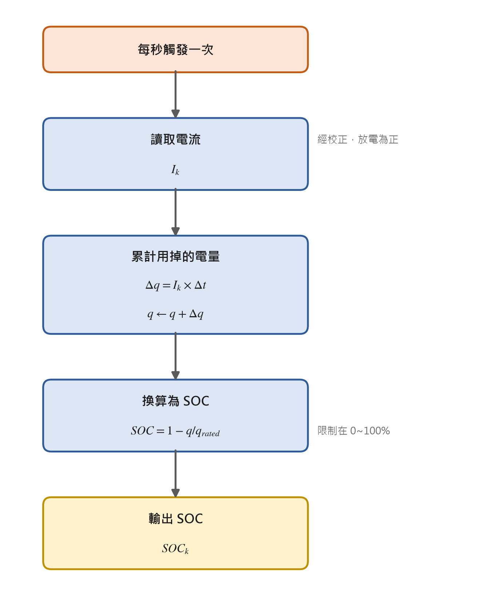
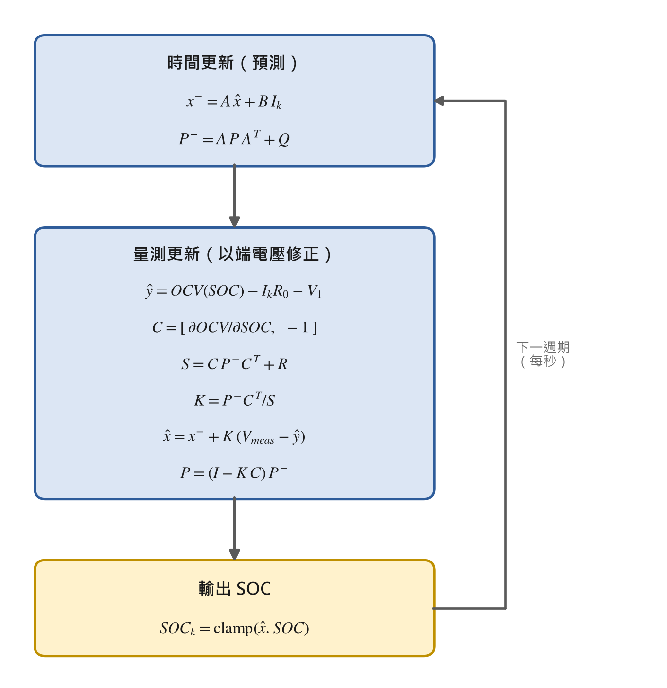
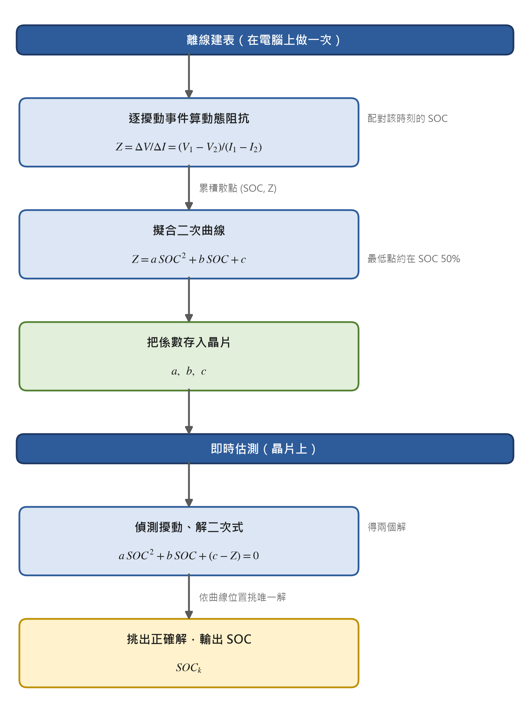
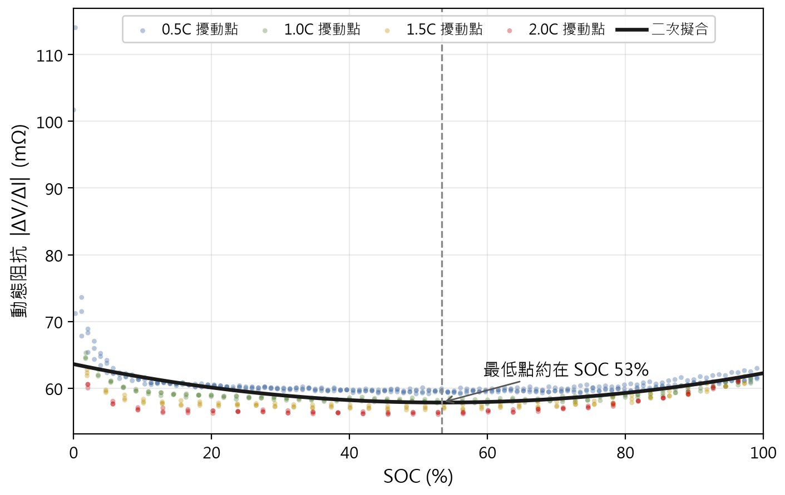
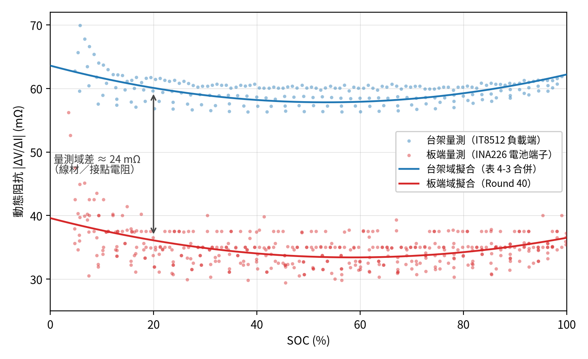
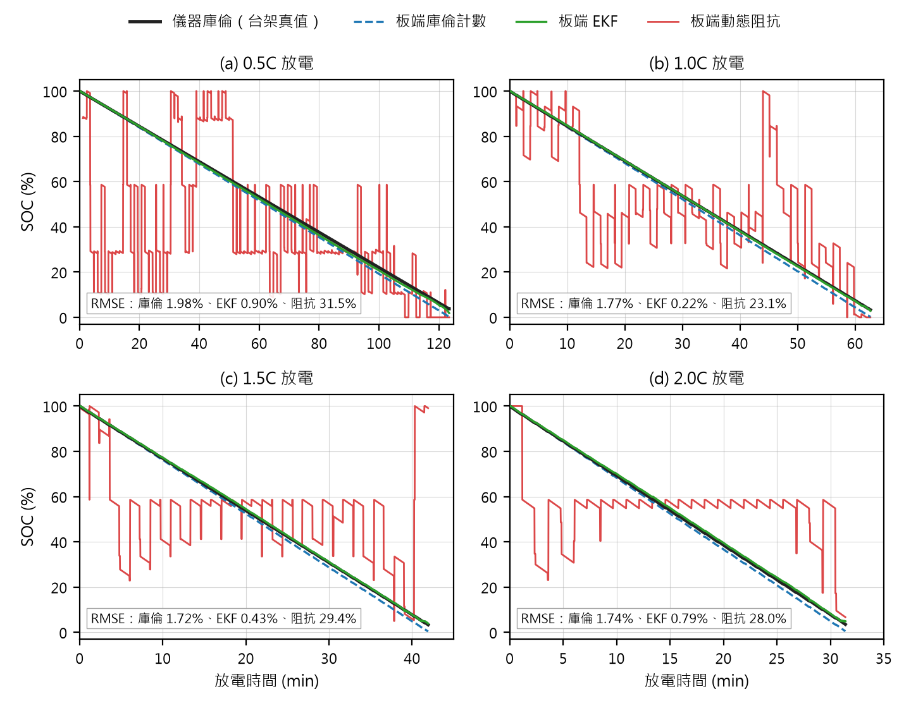

# 第四章 SOC 估測方法之實作與比較

## 4.0 本章共同前提

本章三種方法皆掛載於第三章所述的共同韌體骨架，替換的僅是最核心的估測模組，其餘量測路徑（INA226 校正後的電流／電壓）、時間基準（固定的系統節拍）與輸入輸出（每秒一次的狀態回報）完全一致，以確保比較的公平性。為使三法在同一座標上比較，先統一界定下列共同量與符號。

**取樣與時間基準**：微控制器端的 SOC 估測每秒更新一次（$\Delta t = 1$ s），資料來源為 INA226 校正後的電流 $I_k$（放電為正）與端電壓 $V_{t,k}$。儀錶端（IT6302／IT8512A+）真值以 0.4 s 取樣作為交叉驗證。電流量測經第三章校正後全範圍誤差 $< 0.21$ mA（$< 1‰$），此為三法共同的量測根基。

**SOC 真值（ground truth）之界定**：本章以庫倫計數作為其他方法的精度對照基準（4.1 節說明其作為真值的正當性）。為消除電流偏移的長期漂移對「真值」本身的污染，逐 cycle 的 SOC 真值定義為「以該 cycle 實測滿放電容量 $q_{full}$ 正規化的庫倫積分」：

$$SOC_{truth}(t) = 1 - \frac{\int_{t_0}^{t} I(\tau)\, d\tau}{q_{full}}$$

如此使每個放電 cycle 的起點錨定於 100%、截止點錨定於 0%，兩端皆有絕對錨點，中間以高精度電流積分線性內插，是短至中時間尺度內可信賴的 SOC 參考（其侷限見 4.1.4）。

**受測電池**：客製化 NMC 鋰離子電池，標稱容量 $C_{rated} = 2000$ mAh，$V_{cv} = 4.2$ V，$V_{cut} = 2.5$ V。本章所有實驗均於室溫進行，不做溫度補償（列為第六章限制）。

**比較指標**（4.4 節展開，此處先界定符號）：

| 類別 | 指標 | 符號／定義 |
|---|---|---|
| 精度 | 均方根誤差 | $RMSE = \sqrt{\frac{1}{N}\sum_k (\widehat{SOC}_k - SOC_{truth,k})^2}$ |
| 精度 | 平均絕對誤差 | $MAE = \frac{1}{N}\sum_k \lvert \widehat{SOC}_k - SOC_{truth,k}\rvert$ |
| 精度 | 最大絕對誤差 | $e_{max} = \max_k \lvert \widehat{SOC}_k - SOC_{truth,k}\rvert$ |
| 精度 | 收斂時間 | $t_{conv}$：自錯誤初值起，誤差首次且持續落入 $\pm 2\%$ 帶之時間 |
| 強健性 | 初值錯誤恢復 | 初值偏移 $\pm 20\%$ 後之 $t_{conv}$ 與穩態誤差 |
| 強健性 | C-rate 切換 | 倍率階躍瞬間之誤差尖峰 |
| 嵌入式資源 | Flash／RAM／CPU | 模組淨增 Flash bytes、RAM bytes、每次更新 CPU cycles |
| 工程性 | 校正需求／LoC | 所需離線校正資料、實作行數 |

---

## 4.1 庫倫計數法（兼基準真值）

### 4.1.1 原理

庫倫計數法（安時積分法）對流經電池的電流積分以累計電量變化，由初始 SOC 遞推當前 SOC（符號與第二章 2.2.1 節一致，放電電流為正）：

$$SOC(t) = SOC(t_0) - \frac{1}{C_{rated}} \int_{t_0}^{t} I(\tau)\, d\tau$$

其中 $SOC(t_0)$ 為初始 SOC、$C_{rated}$ 為額定容量、$I(\tau)$ 為電流（放電為正）。在本研究單一 NMC 電池、室溫條件下，充放電效率接近理想，積分式不另作效率折減，其長期影響併入漂移討論（4.1.4）。

庫倫計數之所以同時擔任本章三法比較的**基準真值**，理由有三：(1) 其估測完全由電流積分決定，不依賴電池模型參數，無模型失配風險；(2) 第三章已將 INA226 電流校正至 $< 1‰$，使積分核心可信；(3) 如 4.0 節所述，逐 cycle 以實測滿放容量正規化後，放電起訖兩端皆有絕對錨點，中段由高精度積分內插，短中時間尺度的相對 SOC 軌跡可信賴。須強調此「真值」僅在**單一 cycle 內**成立——跨 cycle 的長期漂移正是庫倫計數的根本弱點（4.1.4），故 4.2／4.3 的精度比較均在逐 cycle 重新錨定的框架下進行。

### 4.1.2 演算法

離散化後，每個取樣週期 $\Delta t$ 更新一次積分器。為與第三章「放電擾動期間庫倫不可漏計」的紀律一致，積分涵蓋包含 dV/dI 擾動停留在內的每一秒。其更新流程如圖 4-1 所示：每秒讀取一次校正後電流，乘以 $\Delta t$ 得本週期電荷增量，累加至「已流出電荷」後，再以額定容量正規化並夾限得 SOC。

> 圖 4-1　庫倫計數法之 SOC 更新流程（每秒執行一次）

### 4.1.3 嵌入式實作

庫倫計數在微控制器上的實作是三種方法中最輕量的：每秒只做一次乘法與一次加法，把當下電流換算成這一秒用掉的電量並累加，需要時再換算成 SOC。它不需要查表、不需要矩陣運算，因此佔用的程式空間、記憶體與運算量都最少，構成後續 4.4 節資源比較的下限基準。實作時以足夠的精度累計電量，避免長時間累加造成的誤差，並把輸出的 SOC 限制在 0～100% 的合理範圍。

### 4.1.4 實驗結果（rate-capability 與 ground-truth 有效性，實測）

庫倫計數的實驗結果同時驗證兩件事：其一為電流積分核心於本平台的自洽性（容量再現性），其二為其作為真值的有效範圍與漂移侷限。資料取自第三章跨輪測試協定累積的週期紀錄（rounds 1–34，cycles 1–160，連續自 2026-05-12 至 06-15）。

**fresh-cell 容量再現性與 rate capability（實測）**：以前三輪 fresh-cell baseline 各四種放電倍率的實測安時量（庫倫積分至截止），整理如表 4-1。

| 倍率 | Round 1 (mAh) | Round 2 (mAh) | Round 3 (mAh) | 平均保持率 |
|---:|---:|---:|---:|---:|
| 0.5C | 1677.6 | 1661.9 | 1657.5 | ~100.0% |
| 1.0C | 1651.8 | 1660.0 | 1658.7 | ~99.5% |
| 1.5C | 1646.7 | 1657.4 | 1655.7 | ~99.3% |
| 2.0C | 1644.9 | 1652.1 | 1647.4 | ~98.9% |

> 表 4-1　fresh-cell 三輪各倍率實測放電容量（庫倫積分，數據源為跨輪週期紀錄 cycles 1–13）

由表 4-1 可得兩項觀察：(1) 此 NMC 電池的 **rate capability 極平坦**——自 0.5C 至 2.0C（1C = 2 A）放電容量僅下降約 1%，反映其內阻低、極化小，是後續方法比較的有利條件（高倍率下端電壓仍接近 OCV，模型失配較小）。(2) 同倍率跨輪再現性佳（0.5C 三輪 1657–1678 mAh），佐證測試協定與 INA226 校正的穩定性。此「滿放容量」即 4.0 節 SOC 真值正規化所用的 $q_{full}$。

**作為真值的漂移侷限（實測佐證與設計分析）**：庫倫計數作為**即時獨立方法**的根本弱點為誤差累積。以第三章校正殘差為例，電流校正後雖 $< 0.21$ mA，但若殘餘偏移以最壞情形 0.2 mA 持續積分，1 cycle（約 2 h @ 0.5C）累積的電荷誤差約為 $0.2\text{ mA} \times 7200\text{ s} = 1.44$ A·s $\approx 0.4$ mAh，相對 2000 mAh 約 0.02%／cycle——短期可忽略，但連續數百 cycle 若無 OCV 修正則線性放大。週期紀錄中 0.5C 容量自 round 1 的約 100.8% 緩降至 round 34 的約 97.5%，此變化混合了**真實老化**與**測量再現性**，需第五章以三輪 baseline 變異性加以分離；就本章而言，重點在於庫倫計數**無自我修正能力**，這正是 EKF 引入端電壓觀測修正的動機，也是 4.4 強健性比較中「初值錯誤恢復」一項庫倫計數必然失分之處。

**作為 ground truth 的使用方式（本章框架）**：4.2／4.3 兩法的精度評估，均以「逐 cycle 重新錨定的庫倫 SOC」為對照。具體流程為：對每個放電 cycle，以該 cycle 起點為 $SOC_{truth}=100\%$、以實測 $q_{full}$ 正規化積分得逐秒 $SOC_{truth}(t)$，再與待評估方法的 $\widehat{SOC}(t)$ 逐點相減計算 RMSE／MAE／$e_{max}$。此框架使「真值本身的長期漂移」被排除在比較之外，確保比較的是各方法的**模型／演算法能力**，而非積分器漂移。

---

## 4.2 擴展卡爾曼濾波器（EKF）

### 4.2.1 原理與狀態空間模型

EKF 將 SOC 視為動態系統的隱藏狀態，融合「電流積分（模型預測）」與「端電壓（量測更新）」兩路資訊，在過程雜訊與量測雜訊並存下對 SOC 做遞迴最小均方誤差估測，兼具庫倫計數的良好動態與 OCV 的絕對校正能力，並能自初值錯誤收斂（第二章 2.2.3 節）[3]。

採第二章 2.1.3 節所述的一階 RC（戴維寧）模型作為基礎結構，狀態取 $\mathbf{x} = [SOC,\ V_1]^T$，輸入 $u = I$（放電為正），輸出 $y = V_t$。連續時間方程為：

$$\begin{cases} \dot{SOC} = -\dfrac{1}{C_{rated}} I \\ \dot{V}_1 = -\dfrac{1}{R_1 C_1} V_1 + \dfrac{1}{C_1} I \\ V_t = V_{OC}(SOC) - I R_0 - V_1 \end{cases}$$

以取樣週期 $\Delta t$ 離散化（前向 Euler），得狀態轉移與觀測：

$$\mathbf{x}_{k+1} = \underbrace{\begin{bmatrix} 1 & 0 \\ 0 & e^{-\Delta t / \tau_1} \end{bmatrix}}_{\mathbf{A}_k} \mathbf{x}_k + \underbrace{\begin{bmatrix} -\Delta t / C_{rated} \\ R_1\left(1 - e^{-\Delta t/\tau_1}\right) \end{bmatrix}}_{\mathbf{B}_k} I_k + \mathbf{w}_k$$

$$y_k = V_{OC}(SOC_k) - I_k R_0 - V_{1,k} + v_k$$

其中 $\tau_1 = R_1 C_1$。$V_1$ 的離散化採零階保持（ZOH）精確解 $e^{-\Delta t/\tau_1}$ 而非單純 Euler，以避免 $\Delta t$ 相對 $\tau_1$ 不夠小時的離散化誤差。

### 4.2.2 觀測非線性與線性化

觀測方程的非線性源自 $V_{OC}(SOC)$。本研究以開路電壓特性量測（GITT 標準協定）建立的 pseudo-OCV 表 [12] $V_{pseudo}(SOC)$ 作為此函數，於 MCU 上以分段線性內插求值。EKF 量測更新所需的觀測雅可比為：

$$\mathbf{C}_k = \frac{\partial y}{\partial \mathbf{x}}\bigg|_{\hat{\mathbf{x}}_k} = \begin{bmatrix} \dfrac{\partial V_{OC}}{\partial SOC}\bigg|_{\widehat{SOC}_k} & -1 \end{bmatrix}$$

其中 $\partial V_{OC} / \partial SOC$ 由 OCV 表相鄰節點的斜率取得（分段線性下即該段斜率）。為避免 GITT 表 5% 步長造成斜率階梯不連續而擾動濾波器，OCV 表於載入時先以 1% 細網格重新內插並平滑，使雅可比連續（細節見 4.2.4）。

### 4.2.3 演算法（標準 EKF 遞迴）

每個週期（每秒）執行一次「預測—更新」遞迴，流程如圖 4-2 所示：先由電流以狀態方程做時間更新（得到狀態與不確定度的預測），再以實際量到的端電壓做量測更新（計算修正增益、把預測拉回實際），輸出限幅後的 SOC 並進入下一週期。

> 圖 4-2　EKF 之預測—更新遞迴流程（一階 RC，狀態 [SOC, V1]）

此問題的狀態只有兩維、觀測只有一維，因此增益計算僅需一次純量除法、無需一般矩陣求逆——這是擴展卡爾曼濾波器能在微控制器上即時運行的關鍵。其中電池內阻與極化等模型參數，由 GITT 各脈衝的鬆弛曲線以最小平方辨識（取 SOC 20–90% 中段平均，n=15）：歐姆內阻 $R_0$ = 75.9 mΩ（台架量測域；部署域換算見 4.2.5）、極化電阻 $R_1$ = 21.3 mΩ、時間常數 $\tau_1$ = 177.5 s，逐脈衝擬合殘差均低於 2 mV。過程雜訊與量測雜訊以 PC 重放做網格搜尋，$Q_{SOC}=10^{-8}$、$R_{meas}=(10\,\mathrm{mV})^2$ 已位於最佳區（重放 RMSE 對 12 組 Q／R 組合的變動不足 0.7%，顯示濾波器對調參並不敏感）。

### 4.2.4 嵌入式實作

EKF 在微控制器上的負擔明顯高於庫倫計數：它需要一張開路電壓對照表，並在每秒做一次小型的「預測—更新」運算與一次端電壓比對來修正估測。由於本研究所用微控制器沒有硬體浮點運算單元，這些運算改以軟體模擬完成，因此耗用的運算時間最長、佔用的程式空間與記憶體也最大——這正是 4.4 節要量化的「以較高資源換取較佳精度與強健性」的代價。實作上採用數值穩定的更新方式，並把估測值限制在合理範圍，以確保長時間運行不發散。

### 4.2.5 實驗結果（實測）

**OCV 表（前置產物）**：GITT 於 2026-07-05 執行（放電單向、5% 步進 × 0.5C × 30 分鐘鬆弛），取得含滿電錨點共 20 個平衡電位點（SOC 4.88–100%）；末步觸及 2.5 V 化學下限而提前中止，故 SOC < 4.88% 無實測點，表格 0% 節點為邊界外插並於韌體中如實註記。各點鬆弛末段的 $|dV/dt|$ 除最低 SOC 點外均低於 0.11 mV/min，平衡性充分。經 1% 細化與 5 點移動平均後重取 5% 節點，得 21 點對照表，全表嚴格單調遞增（分段線性雅可比恆正）。

**PC 重放驗證**：以與韌體逐行等價的 PC 原型重放 GITT 全程資料（8,625 樣本、約 11.5 小時），並以電流積分的庫倫 SOC 為真值：追蹤 RMSE 0.60%、最大誤差 2.2%；以電壓播種（開機情境）結果相同；刻意給 50% 錯誤初值時，因初始不確定度設為 $(20\%)^2$，首次量測更新即將估值拉回電壓所指的 SOC（單步收斂）。此步驟同時確認 Q／R 的選擇（見 4.2.3）。須說明此重放與參數辨識使用同一份 GITT 資料（in-sample，即以同一份資料調參又驗證），故獨立驗證由下述整輪板端實測承擔。

**板端整輪實測（各四倍率放電 cycle）**：STM32 端 EKF 每秒以 INA226 量測更新，與台架庫倫真值逐秒比對。首輪（Round 40，$R_0$ 沿用 GITT 台架域辨識值 75.9 mΩ）的 RMSE 隨倍率單調劣化——0.5C／1.0C／1.5C／2.0C 分別為 0.87%／2.50%／3.67%／4.48%，且恆為正偏（+0.83% 至 +4.20%）。其來源定位為**量測域錯位**：辨識 $R_0$ 時所用的負載電壓取自電子負載端（含電池至負載間的線材與接點電阻約 24 mΩ），而板端 EKF 使用 INA226 於電池端子量得的電壓——模型的歐姆壓降因此被多算了 $24\,\mathrm{m\Omega} \times I$，隨電流線性放大而將估值推高（此量測域議題的完整分析見 4.3.4，兩法互為佐證）。

將 $R_0$ 換算至電池端域（51.9 mΩ）後複測（Round 41），**四倍率 RMSE 全數降至 1% 以內、倍率相依偏差完全消失**（−0.75% 至 +0.74%，無單調趨勢）——量測域假設由獨立複測嚴格證實，修正後結果如表 4-2：

| 倍率 | RMSE (%) | MAE (%) | $e_{max}$ (%) | 偏差方向 |
|---:|---:|---:|---:|---:|
| 0.5C | 0.90 | 0.76 | 1.86 | −0.75 |
| 1.0C | 0.22 | 0.20 | 0.57 | −0.04 |
| 1.5C | 0.43 | 0.39 | 0.76 | +0.39 |
| 2.0C | 0.79 | 0.74 | 1.36 | +0.74 |

> 表 4-2　EKF 各倍率板端實測精度（Round 41，電池端域 $R_0$=51.9 mΩ；開機以電壓播種、起始即收斂，故不另列收斂時間；初值錯誤收斂見 4.4.2）

**初值錯誤收斂（板端實測）**：透過除錯介面將運行中的 EKF 強制設為錯誤 SOC（偏移 +25%），估值於一次量測更新內即被電壓項拉回、數秒內回到原軌跡——與 PC 重放的單步收斂行為一致，證實 EKF 相對庫倫計數的核心優勢（後者無任何修正機制，見 4.4.2）。

---

## 4.3 動態阻抗法

### 4.3.1 原理

動態阻抗法 [1] 避開「需初始值」與「需長時間靜置」兩大限制，改以電池工作中端電壓對電流的瞬時變化率推估 SOC。定義動態阻抗為相鄰擾動兩點的電壓差比電流差：

$$Z_{dyn} = \frac{\Delta V}{\Delta I} = \frac{V_1 - V_2}{I_1 - I_2}$$

該文獻的關鍵發現為 $Z_{dyn}$ 與 SOC 呈近似拋物線關係，可二次擬合（第二章 2.2.4 節）：

$$\frac{\Delta V}{\Delta I} = a\,(SOC)^2 + b\,(SOC) + c$$

物理上，電池於接近滿電與接近放空時動態阻抗較高、在 $SOC \approx 50\%$ 附近最小。因拋物線對稱，單一 $Z_{dyn}$ 對應兩個可能的 SOC，須以 $Z_{dyn}$ 對 SOC 的變化率正負判別位於曲線哪一側，以取唯一解 [1]。

### 4.3.2 擾動數據來源（與第三章協定耦合）

本研究的跨輪測試協定已對四種放電 C-rate 注入 dV/dI 擾動：每 60 s 由基礎倍率短暫步降至 0.2C、停留 1 秒後步回（第三章 3.4 節）。取步降前後兩穩態樣本即得該 SOC 下的 $\Delta V/\Delta I$。由於庫倫計數提供逐秒 SOC，每個擾動事件可標記其發生時的 SOC，從而對「$\Delta V/\Delta I$ vs SOC」累積散點。基礎倍率越高、$\Delta I$ 越大、dV/dI 訊噪比越好，故四種倍率全數注入擾動——高倍率數據對拋物線擬合尤為有利。

此設計使動態阻抗法**無須額外實驗**，直接複用 rate-capability 數據中既有的擾動段，是其「嵌入式友善、實驗成本低」的體現。

### 4.3.3 演算法與估測流程

動態阻抗法分為「離線建表」與「即時估測」兩階段，流程如圖 4-3 所示。離線階段（在電腦上做一次）對每個擾動事件算出 $\Delta V/\Delta I$，並配對該時刻的 SOC，累積散點後擬合二次曲線，得係數 $a, b, c$，存入晶片。即時階段（晶片上）於每次偵測到擾動事件時量得 $\Delta V/\Delta I$，代入二次式求解，再依曲線位置挑出唯一解。

> 圖 4-3　動態阻抗法之離線建表與即時估測流程

須注意動態阻抗法**僅在擾動事件發生時**產生獨立估測（本協定為每 60 s 一次），事件之間若需連續 SOC，實務上以庫倫計數內插。故嚴格而言，本法在本平台為「動態阻抗離散校正 + 庫倫內插」的混合形態，4.4 比較時將如實標註此特性。

### 4.3.4 嵌入式實作與實驗結果

**嵌入式實作**：晶片上只需存放擬合得到的幾個係數，偵測到電流擾動時，做一次簡單的差分求出當下的動態阻抗，再解一個二次方程即可得到 SOC。整個過程不需要查開路電壓表、也不需要矩陣運算，運算量介於庫倫計數與 EKF 之間，是三種方法中兼顧「即時、輕量、無須初始值」的代表。

**實驗結果（實測）**：本研究直接複用跨輪測試（fresh-cell baseline，rounds 1–3）放電過程中既有的擾動段，從每個擾動事件算出動態阻抗 $|\Delta V/\Delta I|$，並配對該時刻的庫倫 SOC，累積散點後擬合二次曲線，結果如圖 4-4 所示。動態阻抗確實隨 SOC 呈拋物線：接近放空與接近滿電時較高、SOC 中段最低，最低點約落在 SOC 53%，與文獻所述「最小值在 50% 附近」一致 [1]。

> 圖 4-4　動態阻抗 $|\Delta V/\Delta I|$ 隨 SOC 之實測散點與二次擬合（fresh-cell rounds 1–3，四種放電倍率）

各放電倍率分別擬合的係數整理如表 4-3。一項重要觀察是：低倍率（0.5C）因擾動的電流變化量小、訊噪比較差，散點較分散、擬合殘差較大（約 3.5 mΩ）；倍率越高，散點越乾淨、擬合殘差降至 0.5～0.6 mΩ——這印證了第三章「對所有放電倍率注入擾動、且高倍率資料對擬合更有利」的設計考量。四種倍率與合併擬合所得的最低點 SOC 皆落在約 43～57%、平均約 53%，與理論預期相符。

| 倍率 | 係數 $a$ (mΩ) | 係數 $b$ (mΩ) | 係數 $c$ (mΩ) | 最低點 SOC | 擬合殘差 (mΩ) | 反推 SOC RMSE (%) |
|:---:|---:|---:|---:|---:|---:|---:|
| 0.5C | 24.5 | −27.9 | 66.6 | 56.9% | 3.54 | 9.7 |
| 1.0C | 14.9 | −15.4 | 61.8 | 51.7% | 0.62 | 6.6 |
| 1.5C | 15.6 | −14.6 | 60.3 | 46.9% | 0.59 | 6.6 |
| 2.0C | 16.2 | −14.0 | 59.0 | 43.3% | 0.52 | 6.3 |
| **合併** | **20.2** | **−21.6** | **63.6** | **53.4%** | **2.90** | — |

> 表 4-3　動態阻抗 $|\Delta V/\Delta I|$–SOC 二次擬合係數與反推精度（fresh-cell rounds 1–3 實測；阻抗單位 mΩ，SOC 以分數代入；反推 RMSE 為假設分枝正確之逐點誤差）

**以擬合反推 SOC 之逐點精度（實測）**：將量得的動態阻抗代回二次式解出 SOC（在假設分枝判斷正確的前提下），與庫倫真值逐點比較，各放電倍率的均方根誤差約為 **6～10%**（0.5C 最差、2.0C 最佳，與訊噪比一致，列於表 4-3 末欄）。更關鍵的觀察是其誤差**隨 SOC 高度不均**：SOC 中段（40～60%）誤差明顯較大（約 9～13%），兩端（< 20% 或 > 80%）較小（約 5～9%）。此現象直接源於動態阻抗曲線在中段平緩——最低點附近阻抗對 SOC 幾乎不敏感，使「由阻抗反推 SOC」在中段成為病態問題，亦即微小的阻抗量測誤差會被放大成巨大的 SOC 誤差。以 rounds 1–2 擬合、round 3 留出驗證所得的精度（RMSE 約 7～10%）與上述相當，顯示此結果並非過度擬合，而是方法的固有特性。

此精度水準說明：**單以動態阻抗反推 SOC 不足以獨立提供高解析度估測，尤其在 SOC 中段**。這也正當化了 4.3.3 所述的混合策略——以動態阻抗在擾動事件處提供「無須初值」的離散校正，事件之間再由庫倫計數內插，以維持連續且高解析度的 SOC。

**嵌入式部署之量測域發現（Round 40 實測）**：將表 4-3 的台架擬合係數移植入微控制器後，於整輪測試中線上估測完全失效（RMSE 約 28%）。逐事件解剖原始樣本後確認：板端量測本身乾淨（擾動停留段有 2–3 個穩定樣本），但板端量得的動態阻抗中位數僅 35.0 mΩ，遠低於台架同批擾動的 60–61 mΩ。差值約 24 mΩ，來自**兩個量測點之間的線材與接點電阻**——電子負載在其端子看到的阻抗含配線，INA226 則在電池端子直接量測，後者才是電芯真實的動態阻抗。由於台架域係數的拋物線最低點（57.9 mΩ）高於板端一切量測值，二次式反解的判別式恆無實根，整組查表因而失效。

以板端 447 個擾動事件對台架真值重新擬合，得電池端域係數 $a=18.0$、$b=-21.1$、$c=39.6$ mΩ（擬合殘差 2.5 mΩ、最低點 SOC 58.6%）。兩域的散點與擬合曲線對照如圖 4-5：與台架域係數（$a=20.2$、$b=-21.6$、$c=63.6$）相比，**二次項與一次項幾乎不變，僅常數項平移約 −24 mΩ**——拋物線的形狀由電芯電化學決定，常數項則由量測鏈決定。此發現的工程意涵為：阻抗—SOC 對照表必須與部署端量測鏈在**同一量測域**建立（或顯式校正量測點的偏移），「離線建表、線上查表」若跨量測鏈搬移，將使整組對照失效——這正是評估環境與部署環境失真的具體實例，直接支持第一章 1.2 節的研究缺口論述。此外，本輪亦發現擾動停留的實際長度受儀器命令延遲影響（設定 1 s、實際 2–3 s），協定已將停留顯式改為 3 s，以確保板端 1 Hz 取樣可取得穩定樣本。

> 圖 4-5　動態阻抗之量測域對照：台架（IT8512 負載端）與板端（INA226 電池端子）之 $|\Delta V/\Delta I|$–SOC 散點及各自域內二次擬合（Round 40；兩域斜率項幾乎相同、常數項相差約 24 mΩ 之線材／接點電阻）

**同域係數的線上複測（Round 41）**：改以板端域係數、放電向過濾與停留 3 秒複測整輪後，量測與反解鏈路皆正常（擾動事件的動態阻抗 P10–P90 落在 32.4–37.5 mΩ，位於曲線值域內，二次式亦有實根），線上 SOC 的 RMSE 卻仍高達 23–31%：各事件反解誤差的中位數雖僅 −4.9%，但誤差絕對值超過 20% 的事件佔了 40%，且當真值位於曲線最低點高側（SOC > 65%）時，選錯分枝的比例高達 46%。其根因已不是任何實作缺陷，而是**反解問題本身的病態性**——亦即「由動態阻抗反推 SOC」對量測誤差過度敏感。具體而言，本電芯在電池端量測域的動態阻抗，整條 $Z$–SOC 曲線由高到低的落差僅約 6 mΩ，而單一事件的量測噪聲便有標準差 σ ≈ 2 mΩ（已佔曲線落差的三分之一）；曲線中段的斜率 $|dZ/dSOC|$ 更僅有每 100% SOC 約 5–7 mΩ，使 2 mΩ 的阻抗誤差被放大成 ±30–40% 的 SOC 誤差，再加上此噪聲水準下拋物線兩側的分枝判斷幾近隨機，兩者疊加即造成大幅跳動。至於表 4-3 中 6～10% 的離線精度，是在「假設每個事件都選對分枝」的理想前提下得到的上界；線上並無此種事後保證可以依靠。

**線上軌跡的三種失效型態**：上述病態性在線上 SOC 軌跡（圖 4-6，見 4.4.1 節）中，呈現為三種可直接辨識的型態。其一為**鏡像跳變**：選錯分枝的後果並非小幅偏差，而是解直接落到最低點另一側的鏡像位置（例如真值 90% 時，另一根約在 27%），使軌跡瞬間上下對翻。其二為**最低點夾限平台**：當噪聲使量得的 $Z$ 低於擬合曲線的最低值（33.4 mΩ）時，二次式無實根，韌體只能輸出最低點對應的 SOC——Round 41 全輪 425 個事件中有 111 個（26%）落入此路徑、輸出恆為 58.6%，構成軌跡中段反覆出現的水平平台。其三為**無不確定度加權**：本法在每一擾動事件都獨立重新錨定、事件之間僅以庫倫內插，不像 EKF 具備共變異數機制可依觀測品質調降劣質觀測的權重，因此單一錯誤解會原封保留到下一個事件。三種型態相互疊加，即為線上 RMSE 23～31% 的全貌。4.4.2 節的噪聲注入測試亦與此互相印證——在同一平台、同樣的噪聲下，動態阻抗的輸出抖動與庫倫、EKF 相差達三至四個數量級，顯示問題出於方法的數學結構，而非感測器品質。

**結論**：對此類 $Z$–SOC 曲線平坦的電芯，動態阻抗**線上單獨反推並不可行**——即便量測域、係數域與取樣時序全部正確亦然。本法的實用價值收斂為兩點：(a) 在混合策略中，僅於曲線較陡的低 SOC 端（$|dZ/dSOC|$ 約每 100% SOC 14 mΩ）提供粗略的離散校正；(b) 作為老化指標（動態阻抗的絕對值隨循環成長，見第六章 6.4.1 內阻成長法）[11]。此結論本身即為公平比較框架的產出：文獻 [1] 的方法在其原始情境（鉛酸電池、負載端量測）可行，移植至 NMC 加電池端子量測的情境則受曲線平坦度所限——**方法的可行性邊界由電芯特性與量測鏈共同決定，而非方法本身的普適屬性**。

上述結論並非未經改進嘗試即下：後續實驗（Round 42）已將離線管線的兩項優勢搬上線——以庫倫參考輔助分枝選擇、並以 SOC 分箱累積平均複刻離線的聚合降噪——使線上 RMSE 由 23～31% 降至 12～21%，恰好印證「選錯分枝」與「單事件噪聲」為兩大主因。惟此舉須將選根的自主性讓渡給庫倫計數（喪失「無須初值」的獨立優勢）、中段（40～60%）RMSE 仍達 19～30%、病態依舊，故本節結論維持不變。

三方法（含 EKF）的整體精度將於 4.4 節在同一框架下比較。

---

## 4.4 方法比較

本節為三法的公平比較，其數值除特別註記者外，均取自 Round 40／41 整輪板端**實測**（同電池、同協定、同 MCU、同量測路徑，見第三章與 4.0 節）。

### 4.4.1 精度比較

於同一輪四個放電 cycle（0.5／1.0／1.5／2.0C）上，以 4.0 節框架對三法計算精度指標（各法取四倍率的範圍）：

| 方法 | RMSE (%) | MAE (%) | $e_{max}$ (%) | 收斂時間 | 備註 |
|---|---:|---:|---:|---:|---|
| 庫倫計數（板端） | 1.7–2.0 | 1.5–1.7 | 3.0–3.5 | N/A（無收斂機制） | 恆負偏；來源為板端與台架兩條電流量測鏈的刻度差（約 +1.2%），非演算法誤差 |
| EKF（板端，同域參數） | **0.22–0.90** | 0.20–0.76 | 0.6–1.9 | 單步（電壓播種） | 四倍率皆 <1%，三法最佳；量測域修正前為 0.87–4.5（4.2.5） |
| 動態阻抗（線上，同域係數） | 23–31 | — | ~96 | 首事件（≤60 s） | 反解本質病態：曲線落差僅約量測噪聲的 3 倍、分枝判斷近乎隨機（4.3.4） |
| 動態阻抗（離線、假設分枝正確） | 6–10 | 5–8 | ~20 | — | rounds 1–3、假設每次分枝都選對之理想上界 |

> 表 4-4　三法標稱工況精度比較（庫倫、EKF 與動態阻抗線上為 Round 41 板端實測；動態阻抗離線為 rounds 1–3 實測）

四種軌跡的直觀對照如圖 4-6 所示：於 Round 41 同一輪四個放電 cycle，將台架儀器量測鏈的庫倫真值與板端三法的每秒輸出疊繪於同一時間軸。板端庫倫計數全程平滑，但因兩量測鏈的電流刻度差而恆現輕微負偏（虛線始終落在真值下方）；EKF 軌跡與真值幾乎重合，四倍率 RMSE 均低於 1%；動態阻抗軌跡則同時呈現 4.3.4 所述的三種失效型態——上下對翻的鏡像跳變、反覆回到 58.6% 的最低點夾限平台（於 1.5C 與 2.0C 面板中段尤為明顯）、以及錯誤解保留至下一事件的無記憶重錨——三者的誤差型態與表 4-4 的統計數字互為印證。

> 圖 4-6　三法 SOC 估測軌跡與台架庫倫真值之對照（Round 41 板端實測，四種放電倍率；各面板標註對台架真值之 RMSE）

表中的誤差來源可分為三個層次，且**沒有一層是「演算法設計錯誤」**：第一層是**感測精度**，庫倫計數的負偏來自兩條電流量測鏈之間的刻度差；第二層是**量測域一致性**，EKF 修正前的正偏、以及動態阻抗跨域搬移的失效，都源於「參數與對照表的建立域」和「實際部署的量測域」不一致——此層可完全消除，Round 41 同域修正後 EKF 全倍率已 <1% 即為明證；第三層是**反解問題的本質敏感度**，動態阻抗即使同域仍不可行，係因電芯曲線過於平坦、相對量測噪聲而言訊號不足，這是問題本身的數學限制，無法以工程手段消除。三層誤差能被逐一辨識並分離，唯有在真實嵌入式平台上做受控比較方能達成——此即本研究比較框架的方法學價值。

### 4.4.2 強健性比較

以下就三項壓力測試（全數實測完成）比較三法的強健性。

1. **初值錯誤恢復（實測）**：庫倫計數無修正機制，錯誤初值的偏差永久保留——本研究於 Round 40 前段實際觀察到此現象（開機錨定於非滿電狀態時，其誤差直到下一次充飽重錨才消除），並據此於韌體加入「充飽自動重錨」機制（端電壓 > 4.15 V 且 $|I|$ < 20 mA 持續 60 s 即重錨，整輪 4/4 次正確觸發）。EKF 以除錯介面強制偏移 +25% 後，一次量測更新即拉回（4.2.5）。動態阻抗於首個擾動事件（本協定 ≤60 s）即獨立重估，實測每事件均重新錨定。
2. **C-rate 切換（板端實測）**：充飽後於放電中執行五次倍率階梯切換（0.5→2.0→0.5→1.5→1.0→2.0C，$|\Delta I|$ 最大 2.5 A，SOC 覆蓋 93%–26%），以切換前 60 s 的誤差為基線，量測切換後 120 s 窗內的誤差尖峰。庫倫計數峰值 ≤ 0.21%（積分連續，切換無感）；EKF 峰值 ≤ 0.48%、120 s 殘留 ≤ 0.45%（RC 模型吸收暫態——此亦為同域 $R_0$ 的第三次獨立驗證：切換使 $I \cdot R_0$ 項瞬變達 130 mV，SOC 估值卻僅短暫波動 < 0.5%）；動態阻抗尖峰達 10–48%——五次切換的 $|\Delta I|$（0.83–2.5 A）全數落於事件窗（0.3–4.5 A）內，被當成量測事件並以病態反解錯誤重錨，印證「切換事件須剔除」的預期。此實測亦揭示：**以 $|\Delta I|$ 幅度過濾在階梯負載下不可行**（切換與例行擾動的 $\Delta I$ 幅度重疊），須以已知的激勵時刻白名單或負載形態辨識方能區分。
3. **噪聲抗性（PC 重放實測）**：對 Round 41 的 0.5C 放電資料（板端 1 Hz 量測、7,418 樣本）逐樣本注入獨立同分布高斯噪聲，分三個等級（$\sigma_I/\sigma_V$ = 5 mA／2 mV「INA226 級」、20／10「10× 退化」、50／20「劣質感測」，各 10 個亂數種子），量測各法輸出相對於自身無噪聲軌跡的偏移。結果：庫倫計數抖動僅 0.005–0.054%（積分對零均值噪聲的平均效果最佳，惟其對**非零均值偏置**毫無防禦，見 4.1.4 的漂移侷限）；EKF 抖動 0.018–0.27%、最大偏移 < 2%（Q／R 濾波的有界響應，且對偏置型誤差亦有電壓修正）；動態阻抗於最低噪聲級即呈**災難級敏感**（抖動約 53%、最大偏移 100%）——僅 ±2 mV 已足以翻轉二次反解的分枝、使整條軌跡改變，與 4.3.4 的病態性結論互為印證。原先預期「EKF 最穩」，在零均值噪聲下修正為「庫倫與 EKF 皆穩、庫倫略優」，二者的本質差異在於誤差型態：庫倫懼偏置、EKF 兩者皆有界。

| 壓力測試 | 庫倫計數 | EKF | 動態阻抗 |
|---|---|---|---|
| 初值錯誤恢復 | 不收斂（實測；以充飽重錨補救） | 單步拉回（實測） | 首事件重估 ≤60 s（實測） |
| C-rate 切換尖峰 | ≤0.21%（無感） | ≤0.48%（RC 吸收暫態） | 10–48%（切換被誤當事件重錨） |
| 噪聲下 SOC 抖動 | ≤0.054%（積分平均；懼偏置） | ≤0.27%、有界（濾波） | ≈53%（分枝翻轉，混沌敏感） |

> 表 4-5　三法強健性比較（初值與 C-rate 切換列為板端實測；噪聲列為 PC 重放注入實測，L1–L3 = 5/20/50 mA 與 2/10/20 mV）

### 4.4.3 嵌入式 footprint 比較

本表為論文核心貢獻之一：在同一顆微控制器、同一編譯設定、同一量測路徑下，量測三種方法各自額外佔用的程式空間、記憶體與每次更新所需的運算量。量測方式為比較「只有共用骨架」與「骨架再加上某一方法」兩種版本的容量差，並實際計時單次更新所花的運算量。

| 方法 | 程式空間 (B) | 記憶體 (B) | 每次更新運算量（cycles 中位，@64 MHz） | 是否需浮點 | 備註 |
|---|---:|---:|---:|---|---|
| 庫倫計數 | +1,892 | +24 | 305（4.8 µs） | 否 | 資源下界（int64 累加，含充飽重錨與重錨命令列） |
| EKF | +2,336 | +40 | 15,187（237 µs） | 是（軟浮點） | 含 21 點開路電壓對照表（168 B）與設值命令列 |
| 動態阻抗（無事件） | +1,540 | +48 | 442（6.9 µs） | 是（軟浮點） | 庫倫內插路徑（含放電向事件過濾） |
| 動態阻抗（有事件） | 同上 | 同上 | 6,525（102 µs） | 是（軟浮點） | 差分＋開根＋二次反解（實根路徑），每 60 s 一次 |

> 表 4-6　三法嵌入式資源佔用實測（STM32G071 @64 MHz、-Og、軟浮點；程式／記憶體為對共用骨架之差分量測，運算量為 Rounds 40–41 兩輪共 159,300 次更新之統計中位數）。EKF 之每次更新運算量約為庫倫計數之 50 倍，但摺算後仍僅佔 1 s 更新週期之 0.024%——三法在本平台皆遠未逼近即時性極限，資源差異之意義在更低階 MCU 或更高更新率場景。

此表清楚呈現「精度—資源」的權衡：庫倫計數最省資源但無自我修正能力；EKF 精度與強健性最佳，程式空間、記憶體與運算量的代價亦最高；動態阻抗居中，且實驗成本最低。此即第二章 2.3 節所述「商用晶片為何多捨 EKF」的量化佐證——本研究以同硬體實測填補了文獻少見的缺口，且實測顯示該取捨在 Cortex-M0+ 級距上已不構成即時性障礙（見表 4-6 註）。

### 4.4.4 適用情境建議

綜合精度、強健性與資源三軸的實測結果（4.4.1–4.4.3），依目標應用的約束給出方法選用建議：

| 應用約束 | 建議方法 | 理由（實測佐證） |
|---|---|---|
| 極低成本／算力（8-bit、無 FPU、Flash < 8 KB） | 庫倫計數 + 充飽自動重錨 | 資源下界（+1.9 KB／305 cycles）；重錨機制實測可消除初值偏移，精度上限由電流量測鏈刻度決定（±2%） |
| 中階且需自初值錯誤恢復 | EKF（一階 RC） | 全倍率精度最佳（0.22–0.90%）且單步自錯誤初值收斂；資源代價 +2.3 KB／237 µs 在 Cortex-M0+ 上仍僅佔更新週期 0.024%；參數辨識須與部署量測鏈同域（同域修正前後 4.5% vs 0.9%） |
| 工作中即時、無靜置機會、實驗成本敏感 | 動態阻抗（＋庫倫內插） | 無須初值與靜置、首事件 ≤60 s 重估；但線上單獨反推對平坦曲線電芯不可行（實測 23–31%），僅宜作低 SOC 端粗校正與老化指標 |

> 表 4-7　SOC 方法適用情境建議（本章版；論文壓軸決策表於第六章以全研究結論收束）

---

## 4.5 本章小結

本章於第三章建立的統一平台上，依「原理 → 演算法 → 嵌入式實作 → 實驗結果」的一致結構，實作並比較三種 SOC 估測方法；三法均實作於同一微控制器，並以同一電池、同一協定整輪實測（Round 40／41）。實測結論可濃縮為三點。

其一，**EKF 為全倍率精度最佳者**（0.22–0.90%，四倍率皆 <1%），庫倫計數穩定居中（1.7–2.0%，且其負偏可溯源至兩條電流量測鏈的刻度差，而非演算法本身），動態阻抗線上單獨反推不可行（23–31%，反解病態）——精度排序在方法之間相差達一個數量級，且每一級的誤差來源均已被溯源（表 4-4 的三層次分析）。

其二，**資源階梯已被量化**（表 4-6）：庫倫計數 305 cycles、EKF 15,187 cycles、動態阻抗 442（無事件）與 6,525（有事件）cycles，EKF 的運算代價約為庫倫的 50 倍——但在 64 MHz Cortex-M0+ 上折算僅 237 µs，佔 1 s 更新週期不到萬分之三。「EKF 太重」在本級距 MCU 上並不成立，資源論述的分水嶺在更低階平台。

其三，也是本章最重要的工程發現：**量測域一致性凌駕演算法選擇**。EKF 的倍率相依正偏（$R_0$ 辨識域含線材電阻）與動態阻抗的線上失效（台架域對照表最低點高於板端一切量測值），為同一根因的兩個表現——參數與對照表若非與部署端量測鏈在同一量測域建立，演算法設計再正確也會系統性失準。此假設已由 Round 41 獨立複測嚴格證實：$R_0$ 換算至電池端域後，EKF 的 RMSE 由最高 4.48% 降至全倍率 <1%、倍率相依偏差完全消失。此實測教訓直接回應第一章 1.2 節「評估環境失真」的研究缺口，也是唯有在真實嵌入式平台上做公平比較才可能暴露的問題。而動態阻抗在同域修正後仍不可行，則進一步揭示了更深一層的邊界：**方法能否可行，是由電芯特性（曲線平坦度）與量測鏈（噪聲水準）共同決定，而非演算法本身的普適屬性**。

至此，本章三軸比較（精度、強健性、資源）的各項結果均已由實測取得。第五章將在此基礎上，討論三法並行於同一微控制器的整合策略、運算負載分配、fresh-cell 三輪變異性，以及實驗過程的工程教訓。

---

## 參考文獻（本章引用，完整清單彙整於論文末）

- [1] C.-H. Lin, C.-M. Wang, and C.-Y. Ho, "Implementation of State-of-Charge and State-of-Health Estimation for Lithium-Ion Batteries," in Proc. IECON 2016 - 42nd Annu. Conf. IEEE Industrial Electronics Society, Florence, Italy, Oct. 2016, pp. 18-24.
- [2] G. L. Bressanini, T. D. C. Busarello, and A. Péres, "Design and Implementation of Lead-Acid Battery State-of-Health and State-of-Charge Measurements," in Proc. 2017 Brazilian Power Electronics Conference (COBEP), Juiz de Fora, Brazil, Nov. 2017, pp. 1-6.
- [3] A. Hasan, M. Skriver, and T. A. Johansen, "eXogenous Kalman Filter for Lithium-Ion Batteries State-of-Charge Estimation in Electric Vehicles," arXiv preprint arXiv:1810.09014, 2018.
- [4] Z. Song, J. Hou, X. Li, X. Wu, X. Hu, H. Hofmann, and J. Sun, "The Sequential Algorithm for Combined State of Charge and State of Health Estimation of Lithium-Ion Battery Based on Active Current Injection," arXiv preprint arXiv:1901.06000, 2019.
- [5] Y. Qin, S. Adams, and C. Yuen, "A Transfer Learning-Based State of Charge Estimation for Lithium-Ion Battery at Varying Ambient Temperatures," accepted by IEEE Transactions on Industrial Informatics, 2021 (preprint: arXiv:2101.03704).
- [6] B. Yi, X. Du, J. Zhang, X. Wu, Q. Hu, W. Jiang, X. Hu, and Z. Song, "Bias-Compensated State of Charge and State of Health Joint Estimation for Lithium Iron Phosphate Batteries," arXiv preprint arXiv:2401.08136, 2024.
- [7] A. Barros, E. Peretti, D. Fabroni, D. Carrera, P. Fragneto, and G. Boracchi, "Adaptive Extended Kalman Filtering for Battery State of Charge Estimation on STM32," arXiv preprint arXiv:2504.05936, 2025.
- [8] K. Movassagh, S. A. Raihan, B. Balasingam, and K. Pattipati, "A Critical Look at Coulomb Counting Towards Improving the Kalman Filter Based State of Charge Tracking Algorithms in Rechargeable Batteries," arXiv preprint arXiv:2101.05435, 2021.
- [9] S. Zhao and D. A. Howey, "Global Sensitivity Analysis of Battery Equivalent Circuit Model Parameters," arXiv preprint arXiv:1604.01293, 2016.
- [10] L. D. Couto and M. Kinnaert, "Partition-Based Unscented Kalman Filter for Reconfigurable Battery Pack State Estimation Using an Electrochemical Model," arXiv preprint arXiv:1709.07816, 2017.
- [11] A. Kulkarni, A. Nadeem, R. Di Fonso, Y. Zheng, and R. Teodorescu, "Novel Low-Complexity Model Development for Li-ion Cells Using Online Impedance Measurement," arXiv preprint arXiv:2402.07777, 2024.
- [12] I. Baccouche, S. Jemmali, A. Mlayah, B. Manai, and N. Essoukri Ben Amara, "Implementation of an Improved Coulomb-Counting Algorithm Based on a Piecewise SOC-OCV Relationship for SOC Estimation of Li-Ion Battery," arXiv preprint arXiv:1803.10654, 2018.
- [13] J. Knox, M. Blyth, and A. Hales, "Advancing State Estimation for Lithium-Ion Batteries with Hysteresis: Systematic Extended Kalman Filter Tuning," arXiv preprint arXiv:2311.16942, 2023.

---

## 中原格式對照（套版時參照，不列入正文）

| 項目 | 規範 |
|---|---|
| 紙張／邊界 | A4；上 2 cm、下 2 cm、右 2 cm、左 3 cm |
| 中文字體 | 內文標楷體；行距「最小行高」18 pt |
| 英文字體 | Times New Roman 12 pt |
| 章標題 | 「第四章 SOC 估測方法之實作與比較」置中，另起新頁 |
| 節標題 | 4.1、4.2…靠左；子節 4.1.1、4.1.2…次層靠左 |
| 圖／表標號 | 圖 4-1、表 4-1 依章編號，標題置於圖下／表上 |
| 演算法／實作圖 | 以方塊圖（流程圖／資料流圖）呈現，依「圖 4-x」編號、標題置於圖下；不以程式碼列表呈現 |
| 正文頁碼 | 阿拉伯數字（接續前章） |
